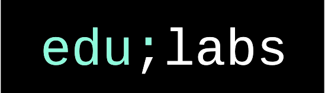

# edulabs

edulabs sind lokale Gruppen aus Menschen, die ihre didaktischen, technischen und gestalterischen Fähigkeiten einsetzen, um zusammen innovative und nachnutzbare Bildungsmaterialien zu entwickeln.

# License

Sofern nicht anders angegeben, stehen die Inhalte dieser Seite unter der <a href="https://creativecommons.org/licenses/by/4.0/deed.de">Creative Commons Namensnennung 4.0 International Lizenz</a>. Soweit die Inhalte auf dieser Seite nicht vom Betreiber erstellt wurden, werden die Urheberrechte Dritter beachtet. Insbesondere werden Inhalte Dritter als solche gekennzeichnet. Sollten Sie trotzdem auf eine Urheberrechtsverletzung aufmerksam werden, bitten wir um einen entsprechenden Hinweis. Bei Bekanntwerden von Rechtsverletzungen werden wir derartige Inhalte umgehend entfernen.

This website is licensed under a [Creative Commons Attribution 4.0 International License](http://creativecommons.org/licenses/by/4.0/). Please read the LICENSE files for more details.

More information: [edulabs.de](http://edulabs.de/impressum)
